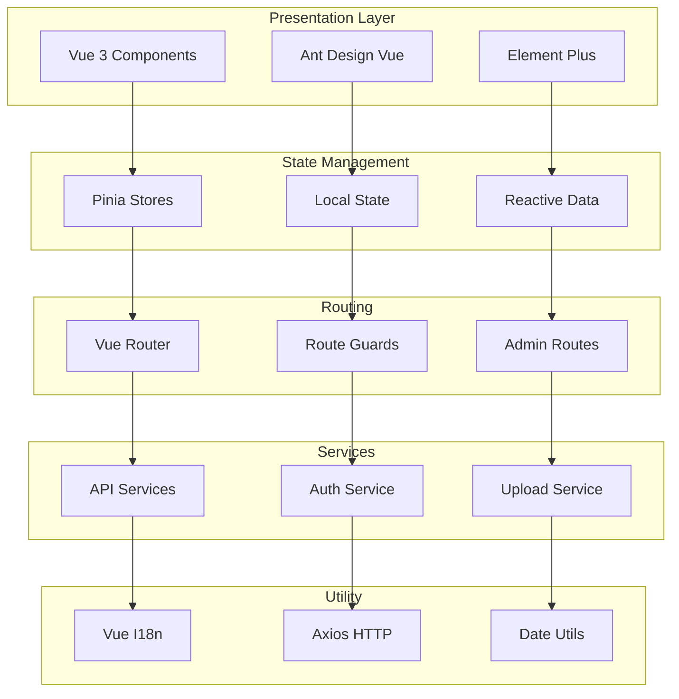

# NUSHungry Frontend

[](https://vuejs.org/)
[](https://vitejs.dev/)

A modern Vue 3 frontend application for the NUSHungry campus dining platform, built with cutting-edge web technologies and featuring a responsive, user-friendly interface.

## System Architecture

This application follows a **component-based architecture** with modern Vue 3 patterns and clean separation of concerns:



##  Project Structure

```
nushungry-frontend/
├── package.json                     # Dependencies and scripts
├── README.md                        # This file
├── Dockerfile                       # Docker containerization
├── docker-compose.yml              # Docker compose configuration
├── vite.config.js                   # Vite configuration
├── vitest.config.js                 # Vitest testing configuration
├── eslint.config.js                 # ESLint configuration
├── index.html                       # HTML template
├── src/
│   ├── main.js                      # Application entry point
│   ├── App.vue                      # Root component
│   ├── assets/                      # Static assets
│   │   └── logo.svg                 # Application logo
│   ├── style.css                    # Global styles
│   ├── components/                  # Reusable Vue components
│   │   ├── AvatarCropper.vue        # Avatar cropping component
│   │   ├── CafeteriaCard.vue        # Cafeteria display card
│   │   ├── Header.vue               # Application header
│   │   ├── ImageGallery.vue         # Image gallery viewer
│   │   ├── ImageUpload.vue          # Image upload component
│   │   ├── ImageUploadDialog.vue    # Image upload modal
│   │   ├── ImageViewer.vue          # Image viewer component
│   │   ├── MapSection.vue           # Map integration component
│   │   ├── ReviewCard.vue           # Review display card
│   │   ├── ReviewForm.vue           # Review submission form
│   │   ├── ReviewList.vue           # Review list component
│   │   ├── StallCard.vue            # Stall display card
│   │   └── admin/                   # Admin components
│   │       ├── AdminLayout.vue      # Admin layout wrapper
│   │       ├── CafeteriaForm.vue    # Cafeteria creation/editing form
│   │       ├── OpeningHoursInput.vue # Opening hours input component
│   │       ├── StallForm.vue        # Stall creation/editing form
│   │       ├── StatCard.vue         # Statistics display card
│   │       └── charts/
│   │           └── UserGrowthChart.vue  # User growth visualization
│   ├── pages/                       # Page components
│   │   ├── AllReviewsPage.vue       # All reviews listing page
│   │   ├── CafeteriaDetail.vue      # Cafeteria details page
│   │   ├── FavoritesPage.vue        # User favorites page
│   │   ├── ForgotPassword.vue       # Password recovery page
│   │   ├── HomePage.vue             # Home page
│   │   ├── LoginPage.vue            # Login page
│   │   ├── MyReviewsPage.vue        # User reviews page
│   │   ├── ProfilePage.vue          # User profile page
│   │   ├── RegisterPage.vue         # Registration page
│   │   ├── SettingsPage.vue         # Settings page
│   │   └── StallDetail.vue          # Stall details page
│   ├── views/                       # View components (admin)
│   │   └── admin/                   # Admin panel views
│   │       ├── AdminDashboard.vue   # Admin dashboard
│   │       ├── AdminLogin.vue       # Admin login page
│   │       ├── CafeteriaManagement.vue # Cafeteria management
│   │       ├── ChangePassword.vue   # Password change page
│   │       ├── ContentModeration.vue # Content moderation
│   │       ├── ImageManagement.vue  # Image management
│   │       ├── ReviewManagement.vue # Review management
│   │       ├── StallManagement.vue  # Stall management
│   │       ├── TokenDebug.vue       # Token debugging utility
│   │       └── UserManagement.vue   # User management
│   ├── router/                      # Vue Router configuration
│   │   ├── index.js                 # Router setup and routes
│   │   └── guards/
│   │       └── adminGuard.js        # Admin route protection
│   ├── stores/                      # Pinia state management
│   │   ├── cafeteria.js             # Cafeteria state store
│   │   ├── locale.js                # Locale/language store
│   │   ├── stall.js                 # Stall state store
│   │   └── user.js                  # User state store
│   ├── services/                    # Business logic services
│   │   ├── authService.js           # Authentication service
│   │   ├── cafeteriaService.js      # Cafeteria API service
│   │   ├── favoriteService.js       # Favorites management service
│   │   ├── imageService.js          # Image handling service
│   │   ├── reviewService.js         # Review API service
│   │   ├── searchService.js         # Search functionality service
│   │   ├── stallService.js          # Stall API service
│   │   ├── uploadService.js         # File upload service
│   │   └── admin/                   # Admin-specific services
│   │       ├── imageService.js      # Admin image service
│   │       └── reportService.js     # Admin reporting service
│   ├── api/                         # API layer
│   │   └── admin/                   # Admin API endpoints
│   │       ├── auth.js              # Admin authentication API
│   │       ├── cafeteria.js         # Cafeteria management API
│   │       ├── dashboard.js         # Dashboard data API
│   │       ├── moderation.js        # Content moderation API
│   │       ├── stall.js             # Stall management API
│   │       ├── user.js              # User management API
│   │       └── users.js             # Users management API
│   ├── locales/                     # Internationalization
│   │   ├── index.js                 # I18n configuration
│   │   ├── en-US.js                 # English translations
│   │   └── zh-CN.js                 # Chinese translations
│   └── utils/                       # Utility functions
│       ├── config.js                # Application configuration
│       ├── date.js                  # Date formatting utilities
│       ├── distance.js              # Distance calculation utilities
│       ├── request.js               # HTTP request utilities
│       ├── role.js                  # Role-based utilities
│       └── stallDebugger.js         # Stall debugging utilities
└── dist/                            # Build output directory
```

## 🔧 Configuration

### Environment Variables

```bash
# API Configuration
VITE_BACKEND_URL=http://localhost:8080

# Application Settings
VITE_APP_NAME=NUSHungry
VITE_APP_VERSION=1.0.0
```

### Vite Configuration

```javascript
// vite.config.js
import { defineConfig, loadEnv } from 'vite'
import vue from '@vitejs/plugin-vue'
import { fileURLToPath, URL } from 'node:url'

export default defineConfig(({ mode }) => {
  const env = loadEnv(mode, process.cwd())

  return {
    plugins: [vue()],
    resolve: {
      alias: {
        '@': fileURLToPath(new URL('./src', import.meta.url))
      }
    },
    server: {
      proxy: {
        '/api': {
          target: env.VITE_BACKEND_URL || 'http://localhost:8080',
          changeOrigin: true
        },
        '/uploads': {
          target: env.VITE_BACKEND_URL || 'http://localhost:8080',
          changeOrigin: true
        }
      }
    }
  }
})
```

### Key Dependencies

```json
{
  "dependencies": {
    "vue": "^3.5.21",
    "vue-router": "^4.5.1",
    "pinia": "^2.1.7",
    "ant-design-vue": "^4.0.0-rc.6",
    "element-plus": "^2.11.4",
    "axios": "^1.4.0",
    "vue-i18n": "^9.14.5",
    "echarts": "^6.0.0",
    "leaflet": "^1.9.4",
    "cropperjs": "^1.6.2",
    "vuedraggable": "^4.1.0"
  },
  "devDependencies": {
    "vite": "^7.1.5",
    "@vitejs/plugin-vue": "^6.0.1",
    "vitest": "^3.2.4",
    "eslint": "^9.36.0",
    "eslint-plugin-vue": "^10.5.0",
    "sass-embedded": "^1.93.2",
    "less": "^4.4.2"
  }
}
```

## 🚀 Getting Started

### Prerequisites

- **Node.js 18** or higher
- **npm 9** or higher
- **Git**

### Development Setup

1. **Clone the Repository**
   ```bash
   git clone https://github.com/SWE5006-Group-7/NUSHungry-Frontend.git
   cd NUSHungry-Frontend
   ```

2. **Install Dependencies**
   ```bash
   npm install
   ```

3. **Environment Configuration**
   ```bash
   # Create environment file
   echo "VITE_BACKEND_URL=http://localhost:8080" > .env.local

   # Edit configuration as needed
   # Set VITE_BACKEND_URL to your backend API
   ```

4. **Start Development Server**
   ```bash
   npm run dev
   ```

5. **Access the Application**
   - **Application URL**: `http://localhost:5173` (Vite's default port)
   - **API Documentation**: Available via backend service

### Testing

```bash
# Run tests in watch mode
npm run test

# Run tests once (CI mode)
npm run test:ci

# Run ESLint
npm run lint
```

### Production Deployment

```bash
# Build for production
npm run build

# Preview production build
npm run preview
```

### Docker Deployment

```bash
# Build Docker Image
docker build -t nushungry-frontend .

# Run Container
docker run -p 5173:5173 \
  -e VITE_BACKEND_URL=http://your-backend-api:8080 \
  nushungry-frontend

# Or use Docker Compose
docker-compose up -d
```

## 🔧 Technology Stack

### Core Framework
- **Vue 3.5+**: Progressive JavaScript framework with Composition API
- **Vite 7.1+**: Fast build tool and development server
- **Vue Router 4.5+**: Official routing solution for Vue

### State Management
- **Pinia 2.1+**: Official state management library for Vue
- **Reactive Stores**: Modular and type-safe state management

### UI Components
- **Ant Design Vue 4.0**: Enterprise-class UI design language
- **Element Plus 2.11**: Vue 3 UI component library
- **Custom Components**: Specialized components for cafeteria/stall management

### Data & Utilities
- **Axios 1.4+**: Promise-based HTTP client
- **Vue I18n 9.14**: Internationalization plugin
- **ECharts 6.0**: Data visualization library
- **Leaflet 1.9**: Open-source JavaScript maps
- **Cropper.js 1.6**: Image cropping functionality
- **VueDraggable 4.1**: Drag and drop functionality

### Development Tools
- **Vitest 3.2+**: Next generation testing framework
- **ESLint 9.36**: JavaScript linting utility
- **Sass/Less**: CSS preprocessing support

## License

This project is licensed under the MIT License.
