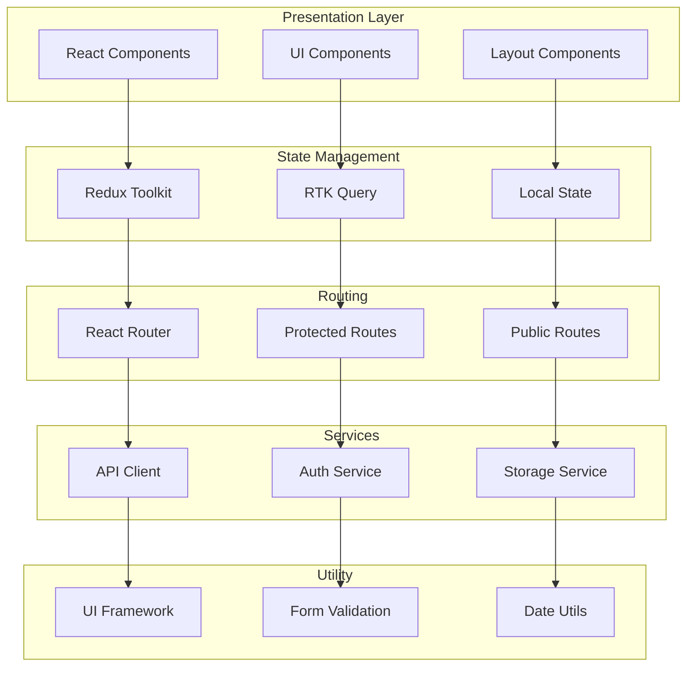

# NUSHungry Frontend

[](https://reactjs.org/)
[](https://www.typescriptlang.org/)

A modern React frontend application for the NUSHungry campus dining platform, built with cutting-edge web technologies and featuring a responsive, user-friendly interface.

## System Architecture

This application follows a **component-based architecture** with modern React patterns and clean separation of concerns:



### Architecture Highlights

- **Component-Based Design**: Modular, reusable React components with clear separation
- **State Management**: Redux Toolkit for global state, local state for component-specific data
- **TypeScript**: Full type safety and improved developer experience
- **Responsive Design**: Mobile-first approach with Tailwind CSS
- **Modern Tooling**: Vite for fast development and optimized builds
- **Progressive Web App**: PWA capabilities for enhanced mobile experience

##  Project Structure

```
nushungry-frontend/
├── package.json                     # Dependencies and scripts
├── README.md                        # This file
├── Dockerfile                       # Docker containerization
├── vite.config.ts                   # Vite configuration
├── tsconfig.json                    # TypeScript configuration
├── tailwind.config.js               # Tailwind CSS configuration
├── .github/workflows/               # CI/CD pipelines
│   └── ci.yml                        # Continuous Integration
├── public/                          # Static assets
│   ├── index.html                   # HTML template
│   └── favicon.ico                  # Favicon
├── src/
│   ├── main.tsx                     # Application entry point
│   ├── App.tsx                      # Root component
│   ├── components/                  # Reusable components
│   │   ├── ui/                      # Base UI components
│   │   │   ├── Button.tsx
│   │   │   ├── Input.tsx
│   │   │   ├── Modal.tsx
│   │   │   └── Loading.tsx
│   │   ├── layout/                  # Layout components
│   │   │   ├── Header.tsx
│   │   │   ├── Footer.tsx
│   │   │   └── Sidebar.tsx
│   │   ├── forms/                   # Form components
│   │   │   ├── LoginForm.tsx
│   │   │   ├── RegisterForm.tsx
│   │   │   └── ReviewForm.tsx
│   │   └── common/                  # Common components
│   │       ├── Card.tsx
│   │       ├── Badge.tsx
│   │       └── StarRating.tsx
│   ├── pages/                       # Page components
│   │   ├── Home.tsx                 # Home page
│   │   ├── Login.tsx                # Login page
│   │   ├── Register.tsx             # Registration page
│   │   ├── Dashboard.tsx            # User dashboard
│   │   ├── Cafeterias.tsx           # Cafeteria listing
│   │   ├── StallDetail.tsx          # Stall details
│   │   ├── Profile.tsx              # User profile
│   │   ├── Favorites.tsx            # Favorites page
│   │   └── admin/                   # Admin pages
│   │       ├── AdminDashboard.tsx
│   │       ├── UserManagement.tsx
│   │       └── Reports.tsx
│   ├── hooks/                       # Custom React hooks
│   │   ├── useAuth.ts               # Authentication hook
│   │   ├── useLocalStorage.ts       # Local storage hook
│   │   ├── useDebounce.ts           # Debounce hook
│   │   └── useInfiniteScroll.ts     # Infinite scroll hook
│   ├── store/                       # Redux store configuration
│   │   ├── index.ts                 # Store configuration
│   │   ├── slices/                  # Redux slices
│   │   │   ├── authSlice.ts         # Authentication state
│   │   │   ├── uiSlice.ts           # UI state
│   │   │   └── favoritesSlice.ts    # Favorites state
│   │   └── api/                     # RTK Query API
│   │       ├── authApi.ts           # Authentication API
│   │       ├── cafeteriaApi.ts      # Cafeteria API
│   │       ├── stallApi.ts          # Stall API
│   │       └── reviewApi.ts         # Review API
│   ├── services/                    # Business logic services
│   │   ├── api.ts                   # API client configuration
│   │   ├── auth.ts                  # Authentication service
│   │   └── storage.ts               # Storage service
│   ├── utils/                       # Utility functions
│   │   ├── constants.ts             # Application constants
│   │   ├── helpers.ts               # Helper functions
│   │   ├── formatters.ts            # Data formatters
│   │   └── validators.ts            # Form validators
│   ├── types/                       # TypeScript type definitions
│   │   ├── auth.ts                  # Auth types
│   │   ├── api.ts                   # API response types
│   │   ├── cafeteria.ts             # Cafeteria types
│   │   └── user.ts                  # User types
│   └── styles/                      # Styles and assets
│       ├── globals.css              # Global styles
│       └── components.css           # Component styles
├── tests/                           # Test files
│   ├── __mocks__/                   # Mock files
│   ├── components/                  # Component tests
│   ├── pages/                       # Page tests
│   └── utils/                       # Utility tests
└── dist/                            # Build output
```

## 🔧 Configuration

### Environment Variables

```bash
# API Configuration
VITE_API_BASE_URL=http://localhost:8080/api
VITE_API_TIMEOUT=10000

# Authentication
VITE_JWT_STORAGE_KEY=nushungry_token
VITE_REFRESH_TOKEN_KEY=nushungry_refresh_token

# Application Settings
VITE_APP_NAME=NUSHungry
VITE_APP_VERSION=1.0.0
VITE_ENABLE_ANALYTICS=false

# Feature Flags
VITE_ENABLE_PWA=true
VITE_ENABLE_DARK_MODE=true
VITE_ENABLE_OFFLINE_SUPPORT=false
```

### Vite Configuration

```typescript
// vite.config.ts
import { defineConfig } from 'vite'
import react from '@vitejs/plugin-react'
import { resolve } from 'path'

export default defineConfig({
  plugins: [react()],
  resolve: {
    alias: {
      '@': resolve(__dirname, 'src'),
      '@components': resolve(__dirname, 'src/components'),
      '@pages': resolve(__dirname, 'src/pages'),
      '@hooks': resolve(__dirname, 'src/hooks'),
      '@utils': resolve(__dirname, 'src/utils'),
      '@types': resolve(__dirname, 'src/types'),
      '@store': resolve(__dirname, 'src/store')
    }
  },
  server: {
    port: 3000,
    proxy: {
      '/api': {
        target: 'http://localhost:8080',
        changeOrigin: true
      }
    }
  },
  build: {
    outDir: 'dist',
    sourcemap: true,
    rollupOptions: {
      output: {
        manualChunks: {
          vendor: ['react', 'react-dom'],
          router: ['react-router-dom'],
          redux: ['@reduxjs/toolkit', 'react-redux']
        }
      }
    }
  }
})
```

## 🚀 Getting Started

### Prerequisites

- **Node.js 18** or higher
- **npm 9** or **yarn 1.22** or higher
- **Git**

### Development Setup

1. **Clone the Repository**
   ```bash
   git clone https://github.com/SWE5006-Group-7/NUSHungry-Frontend.git
   cd NUSHungry-Frontend
   ```

2. **Install Dependencies**
   ```bash
   # Using npm
   npm install
   
   # Using yarn
   yarn install
   ```

3. **Environment Configuration**
   ```bash
   # Copy environment template
   cp .env.example .env.local
   
   # Edit configuration
   # Set VITE_API_BASE_URL to your backend API
   ```

4. **Start Development Server**
   ```bash
   # Using npm
   npm run dev
   
   # Using yarn
   yarn dev
   ```

5. **Access the Application**
   - **Application URL**: `http://localhost:3000`
   - **API Documentation**: Available via backend service

### Production Deployment

```bash
# Build for production
npm run build

# Preview production build
npm run preview

# Build and analyze bundle size
npm run build -- --analyze
```

### Docker Deployment

```bash
# Build Docker Image
docker build -t nushungry-frontend .

# Run Container
docker run -p 3000:3000 \
  -e VITE_API_BASE_URL=http://your-backend-api:8080/api \
  nushungry-frontend
```

## License

This project is licensed under the MIT License - see the [LICENSE](LICENSE) file for details.
